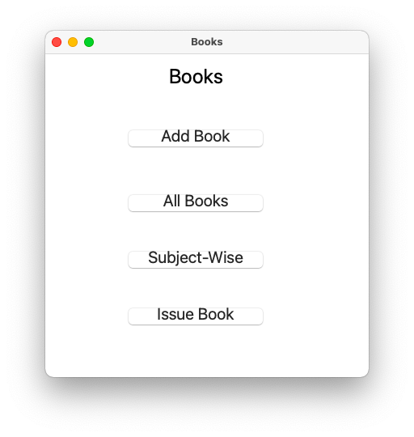
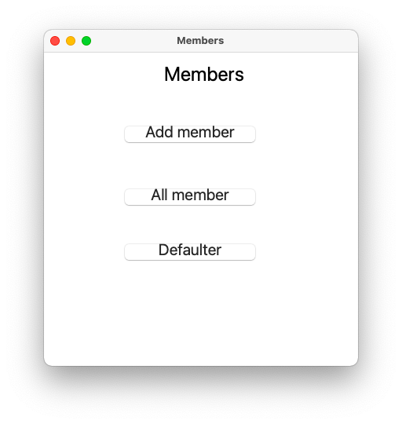
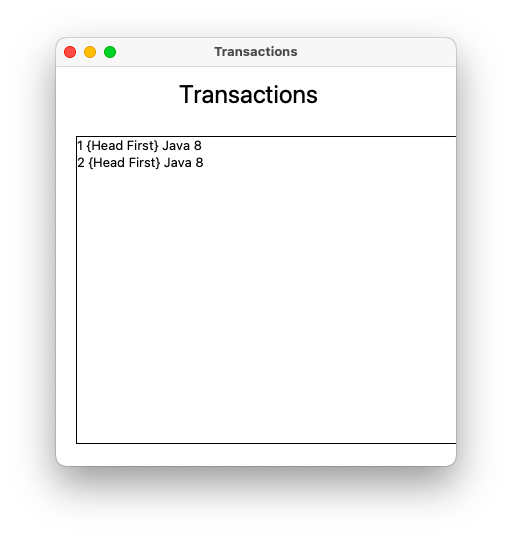

# LibraryManagement

 
Python application for library management using SQLite3 database

## Link to site

## Libraries required
1. [Python3.5.x or above](https://www.python.org/downloads/)
2. [SQLite3](https://pypi.org/project/db-sqlite3/)

## How to start
1. Clone or download the project.
2. Dowload [Python](https://www.python.org/downloads/) and [SQLite3](https://pypi.org/project/db-sqlite3/).
3. Run [Library.py](Library.py) file.

## About application
1. This application can be used for a library management system.
   
2. You can add, delete, issue and see subject wise books of the library.
   
3. You can add and view memebers of libraray as well as can recognise defaulters.
   
4. You can review all transactions.
   
